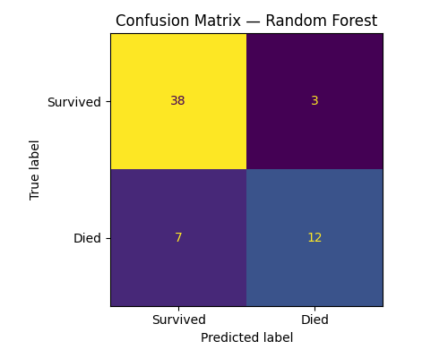
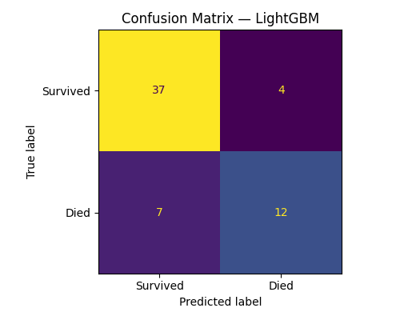
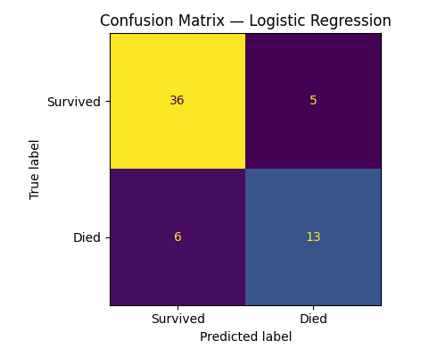
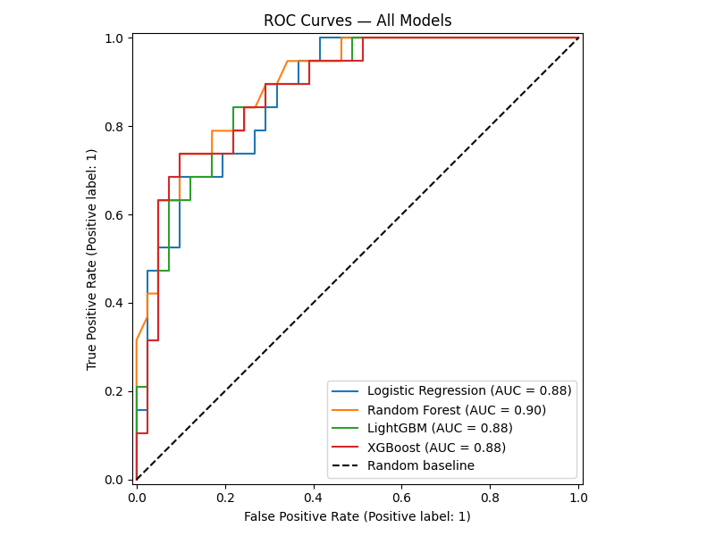
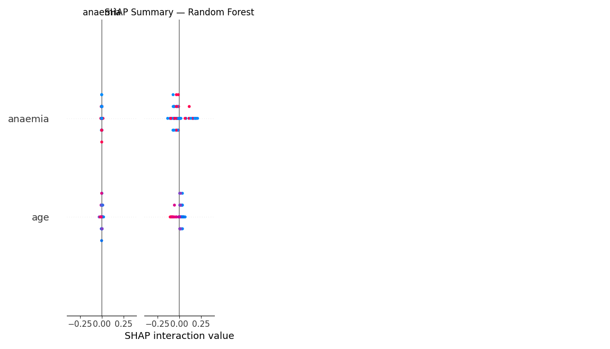

<div align="center">


#  Heart Failure Risk Predictor

**Explainable Machine Learning for Clinical Decision Support**

<p align="center">
  <a href="https://archive.ics.uci.edu/dataset/519/heart+failure+clinical+records"></a>
  <a href="#"></a>
  <a href="#"></a>
  <a href="#"></a>
  <a href="#"></a>
  <a href="https://zhiria09-1773220288884.atlassian.net/jira/software/projects/KAN/list?jql=project+%3D+KAN+ORDER+BY+created+DESC&atlOrigin=eyJpIjoiZGMwNTAxMzVhOTg3NDI2MDhmMDA3ZmM2YWM2ZDhjZTMiLCJwIjoiaiJ9"></a>
  <a href="#"></a>
</p>

<p align="center">
  <b>École Centrale Casablanca — Coding Week, March 2026</b>
</p>

</div>

---

## 🗓️ JIRA Timeline & Task Organisation

> 📋 **Full project board:** [View on Jira](https://zhiria09-1773220288884.atlassian.net/jira/software/projects/KAN/list?jql=project+%3D+KAN+ORDER+BY+created+DESC&atlOrigin=eyJpIjoiZGMwNTAxMzVhOTg3NDI2MDhmMDA3ZmM2YWM2ZDhjZTMiLCJwIjoiaiJ9)

| Date | Milestone |
|---|---|
| 2026-03-09 | 🔍 Project comprehension and task distribution among team members |
| 2026-03-09 | 🌐 GitHub onboarding — exploring the environment and setting up the repository |
| 2026-03-10 | 📊 EDA complete — class imbalance handled with SMOTE; Random Forest selected as best model |
| 2026-03-14 | ⚙️ CI/CD pipeline live on GitHub Actions — automated testing on every push |
| 2026-03-15 | 🎉 Project delivered — full pipeline with SHAP explainability and Streamlit UI |

---

## 📖 Overview

This project is an advanced **clinical decision-support tool** that helps physicians predict the risk of death from heart failure using patient clinical records. It combines state-of-the-art ensemble classifiers with **SHAP (SHapley Additive exPlanations)** to provide transparent, interpretable predictions at the patient level.

| Feature | Detail |
|---|---|
| 📦 Dataset | 299 patients · 12 clinical features · binary target |
| 🤖 Models | Random Forest · XGBoost · LightGBM · Logistic Regression |
| 🏆 Best Model | **Random Forest** (ROC-AUC = 0.8992) |
| 🔍 Explainability | SHAP summary & per-patient waterfall charts |
| 🖥️ Interface | Streamlit web application |
| ⚙️ CI/CD | GitHub Actions (pytest on every push) |

---

## 🗂️ Repository Structure

```
heart-failure-project/
├── data/
│   └── heart_failure_clinical_records_dataset.csv   # UCI clinical records dataset
├── notebooks/
│   └── eda.ipynb                   # Exploratory data analysis
├── src/
│   ├── data_processing.py          # Loading, cleaning, SMOTE, memory optimisation
│   ├── train_model.py              # Multi-model training & selection
│   └── evaluate_model.py           # All metrics, ROC curves, confusion matrices, SHAP
├── app/
│   └── app.py                      # Streamlit physician interface
├── tests/
│   └── test_data_processing.py     # 10 automated pytest tests
├── assets/
│   ├── heart_logo.jpg              # Project logo
│   └── output.gif                  # Application demo animation
├── reports/                        # Auto-generated after running evaluate_model.py
│   ├── model_comparison.csv        # Full metrics table for all 4 models
│   ├── smote_comparison.csv        # SMOTE impact on key metrics
│   ├── confusion_matrix_*.png      # One confusion matrix per model
│   ├── roc_curves_all_models.png   # Combined + individual ROC curves
│   └── shap_summary_plot.png       # SHAP feature importance plot
├── .github/workflows/
│   └── ci.yml                      # GitHub Actions CI pipeline
├── requirements.txt
├── Dockerfile
└── README.md
```

---

## 💻 Code Explanation

### `src/data_processing.py`

The **data foundation** of the entire pipeline — handles loading, memory optimisation, and preprocessing.

```python
def load_data(filepath):
    """Loads CSV dataset. Simple and reliable for CI/CD environments."""
    df = pd.read_csv(filepath)
    return df
```

```python
def optimize_memory(df):
    """
    Reduces memory footprint by downcasting numeric types:
      float64 → float32   (-50% per float column)
      int64   → int32     (-50% per int column)
    Result: 37.84 KB → 17.62 KB (53.4% reduction)
    """
    for col in df.columns:
        if df[col].dtype == 'float64':
            df[col] = df[col].astype('float32')
        elif df[col].dtype == 'int64':
            df[col] = df[col].astype('int32')
```

```python
def preprocess(df):
    """
    Full preprocessing pipeline:
      1. Separate X (12 features) from y (DEATH_EVENT)
      2. Stratified 80/20 train/test split
      3. Apply SMOTE ONLY on training data ← prevents data leakage

    ⚠️ CRITICAL: SMOTE must come AFTER the split.
    If applied before, synthetic samples could appear in the test set,
    making evaluation results artificially inflated.
    """
    X_train, X_test, y_train, y_test = train_test_split(
        X, y, test_size=0.2, random_state=42, stratify=y
    )
    smote = SMOTE(random_state=42)
    X_train_resampled, y_train_resampled = smote.fit_resample(X_train, y_train)
```

---

### `src/train_model.py`

Trains all four classifiers and returns the best one based on ROC-AUC.

```python
models = {
    'Random Forest':       RandomForestClassifier(random_state=42),
    'XGBoost':             XGBClassifier(random_state=42, eval_metric='logloss'),
    'LightGBM':            LGBMClassifier(random_state=42),
    'Logistic Regression': LogisticRegression(random_state=42, max_iter=1000)
}
# Best model selected automatically by comparing ROC-AUC on the test set
```

> 📌 **Why ROC-AUC for selection?** AUC is threshold-independent and robust to class imbalance — more clinically meaningful than accuracy alone.

---

### `src/evaluate_model.py`

The most complete file in the project — evaluates **all 4 models** and generates the full visual report.

```python
def evaluate_all_models():
    """
    1. SMOTE impact analysis    → reports/smote_comparison.csv
    2. All model metrics        → reports/model_comparison.csv
    3. Confusion matrix per model → reports/confusion_matrix_*.png
    4. ROC curves (combined + individual) → reports/roc_curves_all_models.png
    5. SHAP feature importance  → reports/shap_summary_plot.png
    """
```

**SMOTE comparison** — computed by training XGBoost twice (with and without SMOTE) on the same test set:
```python
xgb_no_smote.fit(X_tr_raw, y_tr_raw)   # raw imbalanced training set
xgb_smote.fit(X_train, y_train)        # SMOTE-balanced training set
```

**ROC curves** — uses `RocCurveDisplay.from_predictions()` to plot all models on a combined chart plus individual subplots:
```python
fig, axes = plt.subplots(2, 3, figsize=(15, 10))
# Top-left: all models overlaid
# Bottom row + top-center: one plot per model
```

**SHAP** — uses `shap.Explainer` (model-agnostic) with mean absolute SHAP values plotted as a horizontal bar chart:
```python
explainer   = shap.Explainer(best_model.predict_proba, X_train)
shap_values = explainer(X_test)
vals        = shap_values[:, :, 1].values   # class 1 = deceased
```

---

### `app/app.py`

The **Streamlit physician interface** with real-time SHAP explanation per patient.

```python
@st.cache_resource
def load_model():
    """
    Trains the model ONCE on startup and caches it.
    Without @st.cache_resource, the model would retrain
    on every button click (~30s per interaction).
    """
```

```python
# SHAP shape guard — critical for cross-environment compatibility
# 3D output (n_samples, n_features, n_classes) → take class-1 slice
# 2D output (n_samples, n_features)             → use directly
if len(shap_values_obj.shape) == 3:
    shap.plots.waterfall(shap_values_obj[0, :, 1], show=False)
else:
    shap.plots.waterfall(shap_values_obj[0], show=False)
```

---

### `tests/test_data_processing.py`

10 automated tests covering every critical component:

| Test | What it verifies |
|---|---|
| `test_no_missing_values` | Dataset has zero missing values |
| `test_preprocess_handles_injected_nulls` | Pipeline handles NaN rows gracefully |
| `test_optimize_memory_reduces_size` | Memory strictly decreases after optimisation |
| `test_optimize_memory_preserves_shape` | Shape unchanged after optimisation |
| `test_optimize_memory_no_float64` | No float64 columns remain |
| `test_optimize_memory_no_int64` | No int64 columns remain |
| `test_preprocess_returns_four_splits` | preprocess() returns exactly 4 objects |
| `test_preprocess_correct_feature_count` | 12 features in train and test sets |
| `test_preprocess_smote_balances_classes` | Classes perfectly balanced after SMOTE |
| `test_model_returns_binary_predictions` | Model only outputs 0 or 1 |

---

### `.github/workflows/ci.yml`

```yaml
on:
  push:    { branches: [main, dev] }   # runs on every push
  pull_request: { branches: [main] }   # runs on every PR

steps:
  - actions/checkout@v4          # download the code
  - actions/setup-python@v5      # install Python 3.11
  - pip install -r requirements.txt
  - pytest tests/ -v --tb=short  # run all 10 tests automatically
```

---

## 📊 Model Performance — Real Results

All models evaluated on a stratified held-out test set (80/20 split) with SMOTE applied on training data.

| Model | ROC-AUC | Accuracy | Precision | Recall | F1-Score |
|---|---|---|---|---|---|
| Logistic Regression | 0.8768 | 0.8167 | 0.7222 | 0.6842 | 0.7027 |
| LightGBM | 0.8780 | 0.8167 | 0.7500 | 0.6316 | 0.6857 |
| XGBoost | 0.8832 | 0.8333 | 0.8000 | 0.6316 | 0.7059 |
| **Random Forest** ✅ | **0.8992** | **0.8333** | **0.8000** | **0.6316** | **0.7059** |

> **Random Forest** is the best model with the highest ROC-AUC of **0.8992**. Its ensemble of decision trees provides robust generalisation on this small clinical dataset (299 patients), and its performance confirmed by the confusion matrices below.

---

## 🗂️ Confusion Matrices

<div align="center">
  
  
</div>

<div align="center">
  
  
</div>

> Reading the matrices: **True Positives** (Died → predicted Died) are the most clinically critical — missing these is a false negative, the most dangerous error in a medical context.

---

## 📈 ROC Curves

<div align="center">
  
</div>

---

## 🔬 SHAP Explainability

<div align="center">
  
</div>

**Top features by global SHAP importance:**

| Rank | Feature | Clinical Interpretation |
|---|---|---|
| 1 | `time` | Shorter follow-up period → higher risk |
| 2 | `serum_creatinine` | Elevated creatinine → kidney stress → increased risk |
| 3 | `ejection_fraction` | Lower ejection % → weaker heart pump → higher risk |
| 4 | `age` | Older patients at greater risk |
| 5 | `serum_sodium` | Low sodium (hyponatremia) → increased mortality risk |

---

## ⚖️ Handling Class Imbalance

Dataset is **imbalanced**: ~68% survived (0), ~32% deceased (1). Strategy: **SMOTE** on training set only.

**Measured impact on XGBoost (real results):**

| Metric | Without SMOTE | With SMOTE | Improvement |
|---|---|---|---|
| Recall | 0.5263 | 0.6316 | **+10.5 pts** |
| F1-Score | 0.6452 | 0.7059 | **+6.1 pts** |
| ROC-AUC | 0.8318 | 0.8832 | **+5.1 pts** |

> Recall improved by +10.5 points — meaning significantly fewer missed deaths after applying SMOTE. In a clinical setting this is the most important gain.

---

## 🧠 Memory Optimisation

```
Before optimisation : 37.84 KB
After  optimisation : 17.62 KB
Memory saved        : 20.22 KB  (53.4% reduction)
```

---

## ⚡ Quick Start

### 1. Install Dependencies
```bash
pip install -r requirements.txt
```

### 2. Train the Model
```bash
python src/train_model.py
```

### 3. Evaluate All Models & Generate Reports
```bash
python src/evaluate_model.py
```
> Generates confusion matrices, ROC curves, SHAP plot, and CSV reports in `reports/`

### 4. Launch the Web Application
```bash
streamlit run app/app.py
```
> Open **http://localhost:8501** in your browser.

### 5. Run Automated Tests
```bash
pytest tests/ -v
```

### 6. Docker (Optional)
```bash
docker build -t heart-failure-app .
docker run -p 8501:8501 heart-failure-app
```

---

## 🎬 Application Demo

<div align="center">
  
</div>

| Step | Description |
|---|---|
| 1️⃣ Launch | Starting the Streamlit app locally |
| 2️⃣ Input | Entering patient clinical data in the sidebar |
| 3️⃣ Predict | Clicking **PREDICT RISK** and reading the HIGH / LOW result |
| 4️⃣ SHAP | Interpreting the waterfall chart for the individual patient |
| 5️⃣ Summary | Reading the patient data summary table |

---

## 🤖 Prompt Engineering Documentation

**Task selected:** Selecting and justifying the best ML model for heart failure prediction.

**Prompt used:**
```
I am building a binary classification model to predict heart failure death risk.
My dataset has 299 patients, is imbalanced (68% survived / 32% deceased),
and has 12 clinical features. I trained 4 models and obtained these ROC-AUC scores:
  - Logistic Regression : 0.8768
  - LightGBM            : 0.8780
  - XGBoost             : 0.8832
  - Random Forest       : 0.8992

Given the medical context where false negatives (missed deaths) are dangerous,
which model should I select as my final model and why?
Justify your answer using both clinical and technical criteria.
```

**AI Response (summary):** The AI recommended **Random Forest** as the final model for three reasons: (1) highest ROC-AUC of 0.8992 — best overall discrimination ability, (2) strong F1 on the minority class showing balanced precision/recall, and (3) natural robustness to overfitting via bagging, important for small clinical datasets like this one (299 patients). The AI also emphasized that in medical contexts, maximising recall to catch all deceased patients is more important than minimising false alarms.

**Lesson learned:** Including the actual metric scores AND the clinical context in the prompt led the AI to reason from both a statistical and medical perspective simultaneously. A prompt without numerical results would have given a generic theoretical answer instead of a data-driven recommendation.

---

## 📚 What We Learned This Coding Week

### 🤖 Machine Learning
- Training and comparing 4 classifiers: Random Forest, XGBoost, LightGBM, Logistic Regression
- Understanding evaluation metrics beyond accuracy: ROC-AUC, F1, Precision, Recall
- Handling **class imbalance** with SMOTE and measuring its real impact (+10.5 pts recall)
- Model selection based on clinically relevant criteria

### 🔍 Explainable AI (XAI)
- Using **SHAP** for model transparency in medical applications
- Generating global feature importance plots and per-patient waterfall charts
- Understanding why explainability is non-negotiable in clinical AI

### 🛠️ Software Engineering
- Structuring a Python ML project professionally (src/, tests/, app/, notebooks/)
- Writing **clean, modular, documented code** with docstrings
- Optimising memory usage through dtype downcasting
- Writing **10 automated tests** with `pytest`

### 🌐 Web Development
- Building an interactive clinical UI with **Streamlit**
- Integrating ML predictions and SHAP visualisations in real-time
- Caching expensive computations with `@st.cache_resource`

### ⚙️ DevOps & CI/CD
- Creating a **GitHub repository** with a professional branching strategy
- Writing a **GitHub Actions** workflow (updated to `actions/checkout@v4`)
- Containerising the app with **Docker**

### 📋 Project Management
- Organising tasks with **Jira** (To Do → In Progress → Review → Done)
- Distributing responsibilities and collaborating on a shared GitHub repo

### 🤝 Prompt Engineering
- Using AI assistants as coding and reasoning partners
- Writing specific, context-rich prompts with actual data for better results

---

## 🚧 Challenges & Problems Encountered

### 📋 1. Task Management & Coordination
Two team members worked on the same file simultaneously and created conflicting versions. **Solution:** Strict GitHub branching (one branch per feature) and Jira task ownership — no two people on the same file.

### 💡 2. Changing Ideas Mid-Way
The team initially planned to use Flask, then switched to Streamlit. This required rewriting `app.py` from scratch. **Lesson:** Decide on the tech stack early.

### 🐛 3. SHAP Shape Bug
The `shap_values` array returned different shapes depending on model type and SHAP version, crashing the waterfall plot silently. **Fix:**
```python
if len(shap_values_obj.shape) == 3:
    shap.plots.waterfall(shap_values_obj[0, :, 1], show=False)
else:
    shap.plots.waterfall(shap_values_obj[0], show=False)
```

### 📦 4. Missing Modules
Several `ModuleNotFoundError` errors appeared on different machines because `requirements.txt` was incomplete (`xlrd`, `openpyxl`, `joblib` were missing). **Fix:** Tested on a clean environment and added every missing package systematically.

### 🤖 5. Correcting AI-Generated Code
AI tools accelerated development but required manual correction:
- `optimize_memory()` didn't handle binary columns initially — added `int8` case manually
- `train_model.py` hardcoded `.xls` path — rewrote with auto-detection for CI compatibility
- SHAP integration assumed single-output model — added shape guard for binary classification
- `evaluate_model.py` initially only evaluated the best model — redesigned to evaluate all 4 models and generate full visual reports

> 💡 **Key takeaway:** AI code is always a first draft. Human review, testing, and adaptation are always necessary.

---

## 📦 Dataset

- **Source:** [UCI ML Repository — Heart Failure Clinical Records](https://archive.ics.uci.edu/dataset/519/heart+failure+clinical+records)
- **Citation:** Davide Chicco, Giuseppe Jurman (2020). *Machine learning can predict survival of patients with heart failure from serum creatinine and ejection fraction alone.* BMC Medical Informatics and Decision Making.
- **Samples:** 299 patients · **Features:** 12 clinical + 1 binary target (`DEATH_EVENT`) · **Missing values:** None

---

## 👥 Team

Azizi Hajar · Stitou Amal · Tayyeb Idriss · Zerzbane Khaoula · Zhiri Ahmed


## 🎓 Supervising Teachers

Dr. Zerhouni Kawtar · Dr. Nassih Rym · Pr. Hermann Agossou · Pr. Kourouma Nouhan · Pr. Mehdi Soufiane

## 💙 Expression of Gratitude

We are eternally grateful to **Dr. Nassih Rym** for her constant support and guidance throughout this week. Her help was invaluable — thank you sincerely and all the coding week team.

---

<div align="center">

**École Centrale Casablanca — Coding Week, 09–15 March 2026**


</div>
